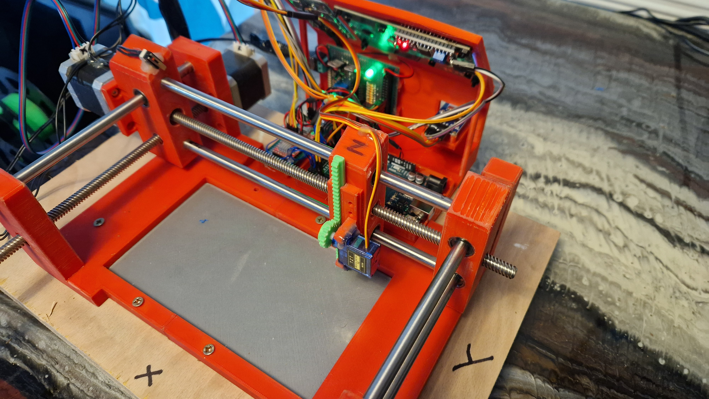
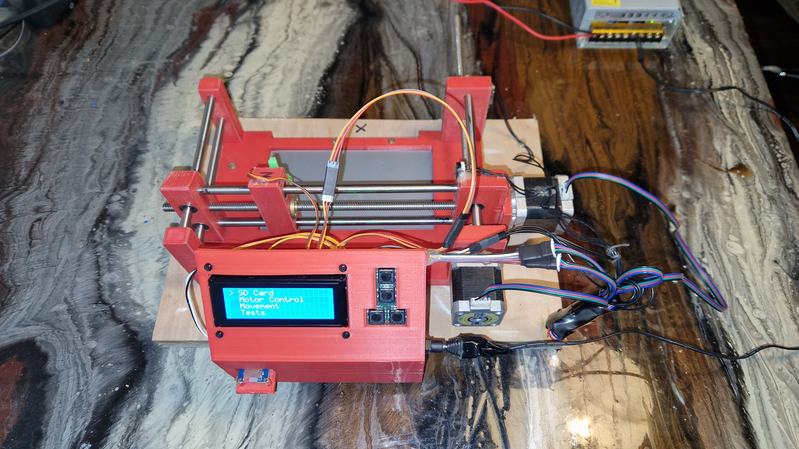

# Moving Arm Control with Arduino

## Table of Contents

- [Moving Arm Control with Arduino](#moving-arm-control-with-arduino)
  - [Table of Contents](#table-of-contents)
  - [General Info](#general-info)
  - [Images](#images)
  - [Features](#features)
  - [Components](#components)
  - [Circuit Diagram](#circuit-diagram)
  - [Code Description](#code-description)
    - [Libraries Used](#libraries-used)
  - [Menu System](#menu-system)
  - [Stepper Motors](#stepper-motors)
  - [Limit Switches](#limit-switches)
  - [Servo Motor](#servo-motor)
  - [SD Card](#sd-card)
  - [Setup](#setup)
    - [Hardware Setup](#hardware-setup)
    - [Software Setup](#software-setup)
  - [Running the Project](#running-the-project)
  - [Testing](#testing)

## General Info

This project controls a robotic arm using an Arduino. The system includes stepper motors for X and Y axes, a servo motor for the Z axis, an SD card for data storage, and an LCD for user interface. Users can navigate through different menus to control the arm, test devices, and manage files on the SD card.

## Images

<div style="display: grid; grid-template-columns: repeat(2, 1fr); gap: 10px;">
    
    
</div>

## Features

- **Menu System**: Navigate through options to control the arm, test devices, and manage SD card files.
- **Stepper Motor Control**: Control X and Y axis movements with stepper motors.
- **Servo Motor Control**: Control Z axis movements with a servo motor.
- **Limit Switches**: Detect and handle end-of-travel for X and Y axes.
- **SD Card Interface**: Read and write data to an SD card.
- **LCD Display**: Display menu options and system status on a 20x4 LCD.

## Components

- Arduino
- Stepper Motors (2)
- Servo Motor (1)
- Limit Switches (2)
- SD Card Module
- LiquidCrystal I2C 20x4 LCD
- Push Buttons (4)
- Various resistors and wires

## Circuit Diagram


## Code Description

### Libraries Used

```cpp
#include <Arduino.h>
#include <AccelStepper.h>
#include <Servo.h>
#include <Wire.h>
#include <SPI.h>
#include <SD.h>
#include <LiquidCrystal_I2C.h>
```

## Menu System

- **Main Menu**: Options for SD Card, Motor Control, Movement, and Tests.
- **Motor Control Menu**: Options to deactivate motors, increase/decrease speed, home XY, and stop.
- **Movement Control Menu**: Options to run/stop/reverse X and Y axes, and run a Z axis test.
- **Tests Menu**: Options to test SD-Comm, 3-Axis, Wifi-Comm, and BLE-Comm.

## Stepper Motors

- **Pins**: `dirPinMotorX`, `stepPinMotorX`, `enablePinMotorX`, `dirPinMotorY`, `stepPinMotorY`, `enablePinMotorY`
- **Configuration**: Using AccelStepper library to control the stepper motors.
- **Control Flags**: `xAxisIsMoving`, `yAxisIsMoving`

## Limit Switches

- **Pins**: `limitSwitchXaxis`, `limitSwitchYaxis`
- **State Variables**: `limitSwitchXState`, `limitSwitchYState`
- **Functions**: Detect when the limit switch is activated to stop motor movement.

## Servo Motor

- **Pin**: `fingerOneServoPin`
- **Configuration**: Using Servo library to control the servo motor.
- **Movement States**: `MOVEMENT_IDLE`, `MOVEMENT_RUNNING`, `MOVEMENT_COMPLETED`

## SD Card

- **Pins**: `chipSelectPin`
- **Functions**: Initialize SD card, read and write files, update menu options based on SD card contents.

## Setup

### Hardware Setup

1. Connect the stepper motors to the appropriate pins on the Arduino.
2. Connect the servo motor to `fingerOneServoPin`.
3. Wire the limit switches to `limitSwitchXaxis` and `limitSwitchYaxis`.
4. Connect the SD card module to the SPI pins and `chipSelectPin`.
5. Connect the LCD to the I2C pins.
6. Connect the push buttons to the designated pins.

### Software Setup

1. Install the necessary libraries (AccelStepper, Servo, Wire, SPI, SD, LiquidCrystal_I2C).

## Running the Project

1. **Upload Code**: Upload the provided Arduino code to your Arduino board.
2. **Power Up**: Power up the Arduino and connected components.
3. **Navigate Menu**: Use the push buttons to navigate through the menu displayed on the LCD.
4. **Control Motors**: Select options from the menu to control the stepper motors and servo motor.
5. **Manage SD Card**: Read and write files to the SD card via the menu options.

## Testing

- **API Tests**: Use the Insomnia testing suite to run API tests. Check the server directory for test files.
- **Manual Tests**: Manually test each function by navigating through the menu and verifying the expected behavior of motors, limit switches, servo, and SD card operations.
